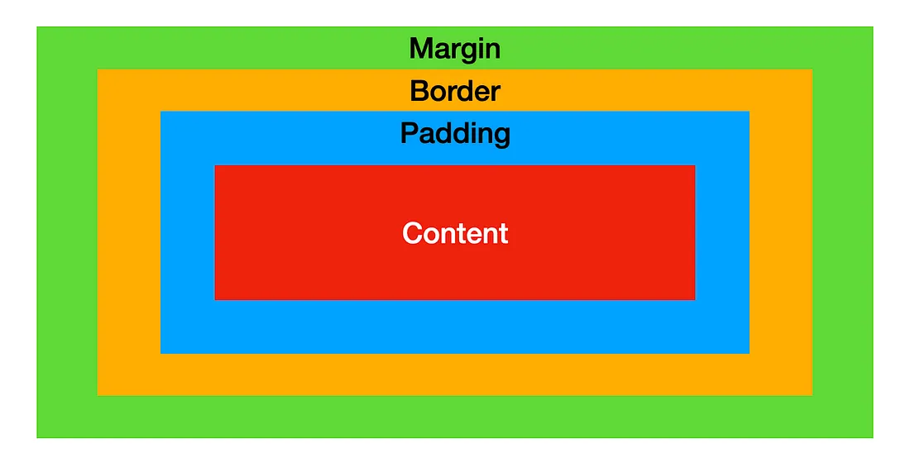

## ① Box Model

HTML 모든 요소는 결국 box

box가 일정한 형태의 모델로 구성한 것을 `Box Model`

우리가 요소들을 스타일링하고 크기와 영역을 잡는데 기본적으로 많이 사용 한다.



- Content

요소의 텍스트나 이미지 등의 실제 내용이 위치하는 영역 <br/>
가로는 `wdith`, 세로는 `height`

- Padding

테두리(Border) 안쪽에 위치하는 요소의 내부 여백 영역, 즉 content와 border 사이의 공간

```CSS
padding : top right bottom left
```

- Border

테두리 영역

```CSS
border: 굵기 스타일 색상;
border : none;
border-radius: px / 50%;
```

- Margin

테두리(Border) 바깥에 위치하는 요소의 외부 여백 영역, 즉 요소와 요소의 간격

```CSS
margin : top right bottom left;

margin : 0 auto; // 가운데 정렬
```

## ② Box Sizing

기본적으로 `content-box`로 설정되어 있다.

`content-box` : only Content의 width, height

`border-box` : content + padding + border의 width, height

```CSS
box-sizing: content-box / border-box
```

## ③ Box

box type이 어떤 것에 따라 요소들이 작동하는 방식이 다 다르다.

```CSS
display : block / inline / block-inline / flex
```

#### ① block

- 항상 새로운 라인에서 시작한다.

- 화면 크기 전체의 가로폭을 차지한다. (width: 100%)

- width, height, margin, padding 프로퍼티 지정이 가능하다.

- block 레벨 요소 내에 inline 레벨 요소를 포함할 수 있다

- block 레벨 요소 예

  - div

  - h1 ~ h6

  - p

  - ol

  - ul

  - li

  - hr

  - table

  - form

1. 따로 width를 선언하지 않은 경우, **width = 부모의 content-box의 100%**

2. 따로 width를 선언한 경우, **남은 공간은 margin으로 자동으로 채움**

또한, margin : 0 auto;를 선언하면 가운데 정렬이 가능함 

-> 다음 요소가 자기 범위에 올라오지 못하도록 막는 성질

3. 따로 height를 선언하지 않은 경우, **자식 요소의 height의 합 = 부모의 height**

#### ② inline

- 새로운 라인에서 시작하지 않으며 문장의 중간에 들어갈 수 있다. 즉, 줄을 바꾸지 않고 다른 요소와 함께 한 행에 위치한다.

- content의 너비만큼 가로폭을 차지한다.

- width, height, margin-top, margin-bottom 프로퍼티를 지정할 수 없다. 상, 하 여백은 line-height로 지정한다.

- inline 레벨 요소 뒤에 공백(엔터, 스페이스 등)이 있는 경우, 정의하지 않은 space(4px)가 자동 지정된다.

- inline 레벨 요소 내에 block 레벨 요소를 포함할 수 없다. inline 레벨 요소는 일반적으로 block 레벨 요소에 포함되어 사용된다.

- inline 레벨 요소 예

  - span

  - a

  - strong

  - img

  - br

  - input

  - select

  - textarea

  - button


#### ③ inline-block

block과 inline 레벨 요소의 특징을 모두 갖는다. inline 레벨 요소와 같이 한 줄에 표현되면서 width, height, margin 프로퍼티를 모두 지정할 수 있다.

- 기본적으로 inline 레벨 요소와 흡사하게 줄을 바꾸지 않고 다른 요소와 함께 한 행에 위치시킬 수 있다.

- block 레벨 요소처럼 width, height, margin, padding 프로퍼티를 모두 정의할 수 있다. 상, 하 여백을 margin과 line-height 두가지 프로퍼티 모두를 통해 제어할 수 있다.

- content의 너비만큼 가로폭을 차지한다.

- inline-block 레벨 요소 뒤에 공백(엔터, 스페이스 등)이 있는 경우, 정의하지 않은 space(4px)가 자동 지정된다. 

