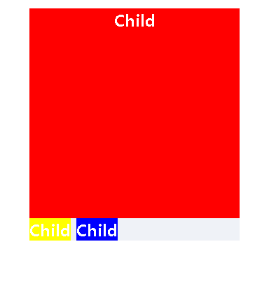
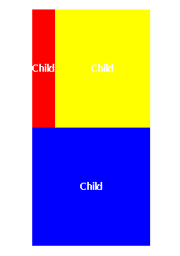

## Float
주로 레이아웃을 구성할 때 `블록 레벨 요소`를 **가로 정렬**하기 위해 사용되는 중요한 기법

요소가 기본 레이아웃 흐름에서 벗어나 요소의 모서리가 페이지의 왼쪽이나 오른쪽에 이동하는 것

### ① Float란?


빨간 박스가 Float : left;를 하면은 부모는 요소가 없다고 생각하여 즉, 빈공간이라 생각하여 뒤에 나머지 요소를 앞으로 채우기 시작한다.

그 후, 자식은 노랑, 파랑 밖에 없다고 인식하고 비어있는 공간을 유지할 필요가 없으니 자식 요소에 맞게 줄어든다.

### ② block?????

어느 한 박스에 Float를 먹인다면 그 박스는 `block`이 된다.

이 말은 block이 할 수 있는 모든 것들을 다 할 수 있다.

`예시` `inline인 span 태그인 박스 중 빨간 박스에게 float : left를 준다면?`

```HTML
전체 div width : 200px;

inline 박스 모델들
```


```HTML
빨강 박스에 float: left;를 준 경우
```


```HTML
빨강 박스에 float: left; width: 100%; height: 200px;를 준 경우
```


- - -

❌❌❌❌❌❌❌ `block`의 속성 중 따로 width를 선언하지 않은 경우, **width = 부모의 content-box의 100%** 
즉, 화면 크기 전체의 가로폭을 차지한다는 여기서 되지 않는다. ❌❌❌❌❌❌❌

➡ 자신의 갖고 있는 content 크기 만큼만 줄어든다. 이말은 즉슨 **Float를 시키면 그 content 크기 만큼 붕 뜬다.**

`예시` `block인 div 태그인 박스 중 빨간 박스에게 float : left를 준다면?`

```HTML
전체 div width : 200px;

block 박스 모델들 height: 200px; line-height: 200px;
```


```HTML
빨강 박스에 float: left;를 준 경우
```


- - -

❌❌❌❌❌❌❌ `block`의 속성 중 따로 따로 width를 선언한 경우, **남은 공간은 margin으로 자동으로 채움** 역시 여기서 되지 않는다.❌❌❌❌❌❌❌

➡ 자동으로 생기는 margin이 생기지 않는다. 왜냐면 생기지 않아야 빈공간을 그 뒤에 요소들이 채워야 하기 때문에

`예시` `block인 div 태그인 박스 중 빨간 박스에게 float : left를 준다면?`

```HTML
전체 div width : 200px;

block 박스 모델들

빨강 박스에만 width: 100px;
```


```HTML
빨강 박스에 float: left;를 준 경우
```


### ③ block vs inline
`block` 요소들은 float를 없는 요소 취급을 하는 반면 

`inline` 요소들은 float의 존재를 잘 인식한다.

### ④ overflow: hidden

앞서 말했듯이 margin이 사라지는 문제가 생긴다.

float 프로퍼티가 선언된 요소가 다음 요소 위에 떠 있는(부유하고 있는) 상태이기에

float 프로퍼티가 선언되지 않는 요소를 앞으로 땡기기 때문이다.

이럴 때 해결 하기 위해서는 float 프로퍼티를 선언하지 않은 요소에

`overflow: hidden` 프로퍼티를 선언하는 것

➡ `overflow: hidden` 프로퍼티는 자식 요소가 부모 요소의 영역보다 클 경우 넘치는 부분을 안보이게 해주는 역할을 하는데 여기서는 float 프로퍼티가 없어서 제대로 표현되지 못하는 요소를 제대로 출력해준다.

### ⑤ Clearfix

`clear`는 오로지 float으로 인해서 망가진 레이아웃을 고치기 위해 탄생한 속성

float 프로퍼티가 선언되지 않는 요소에 `clear`를 선언한다면

float 프로퍼티가 선언된 요소를 인지하여 무시하지 않고 제대로 출력해준다.

그리고 `clear`는 **display : block**인 박스에만 선언이 가능하다.

```CSS
clear : left / right / both
```

### ⑥ Pseudo-Element

하지만 모든 요소에 float가 선언되어 있고 레이아웃을 고치기 위해

아무 용도가 없는 div를 만들어 여기다 `clear`를 선언한다면

망가진 레이아웃을 고칠 수 있지만 아무 용도가 없는 div를 만드는건 좋은 점은 아니다.

이때 필요한건 **CSS 가상요소** `Pseudo-Element`를 이용하여 해결한다.

`Pseudo-Element`는 실제 HTML에는 존재하지 않는 가상 요소 이다.

```CSS
::before {
    content : ""; // 반드시 적어야 할 속성
    display : block;
    clear : left;
}

::after {
    content : ""; // 반드시 적어야 할 속성
    display : block;
    clear : left;
}
```