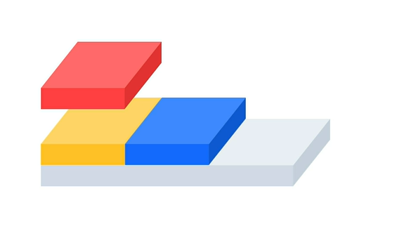
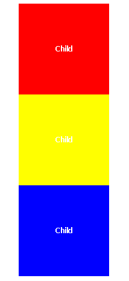

## Float
주로 레이아웃을 구성할 때 `블록 레벨 요소`를 **가로 정렬**하기 위해 사용되는 중요한 기법

요소가 기본 레이아웃 흐름에서 벗어나 요소의 모서리가 페이지의 왼쪽이나 오른쪽에 이동하는 것

### ① Float란?





빨간 박스가 Float : left;를 하면은 부모는 요소가 없다고 생각하여 즉, 빈공간이라 생각하여 뒤에 나머지 요소를 앞으로 채우기 시작한다.

그 후, 자식은 노랑, 파랑 밖에 없다고 인식하고 비어있는 공간을 유지할 필요가 없으니 자식 요소에 맞게 줄어든다.

### ② block?????

어느 한 박스에 Float를 먹인다면 그 박스는 `block`이 된다.

이 말은 block이 할 수 있는 모든 것들을 다 할 수 있다.

`예시` `inline인 span 태그인 박스 중 빨간 박스에게 float : left를 준다면?`

```HTML
inline 박스 모델들

<div style="background-color: #eff2f7; margin: 0 auto; width: 200px;">
    <span style="background-color: red
    ; text-align: center; color: #fff; font-weight: 900;">Child</span>
    <span style="background-color: yellow
    ; text-align: center; color: #fff; font-weight: 900;">Child</span>
    <span style="background-color: blue
    ; text-align: center; color: #fff; font-weight: 900;">Child</span>
</div>

```


```HTML
빨강 박스에 float: left;를 준 경우

<div style="background-color: #eff2f7; margin: 0 auto; width: 200px;">
    <span style="background-color: red
    ; text-align: center; color: #fff; font-weight: 900; float: left;">Child</span>
    <span style="background-color: yellow
    ; text-align: center; color: #fff; font-weight: 900;">Child</span>
    <span style="background-color: blue
    ; text-align: center; color: #fff; font-weight: 900;">Child</span>
</div>
```


```HTML
빨강 박스에 float: left; width: 100%; height: 200px;를 준 경우

<div style="background-color: #eff2f7; margin: 0 auto; width: 200px;">
    <span style="background-color: red
    ; text-align: center; color: #fff; font-weight: 900; float: left; width: 100%; height: 200px;">Child</span>
    <span style="background-color: yellow
    ; text-align: center; color: #fff; font-weight: 900;">Child</span>
    <span style="background-color: blue
    ; text-align: center; color: #fff; font-weight: 900;">Child</span>
</div>
```


❌❌❌❌❌❌❌ `block`의 속성 중 따로 width를 선언하지 않은 경우, **width = 부모의 content-box의 100%** 즉, 화면 크기 전체의 가로폭을 차지한다는 여기서 되지 않는다. ❌❌❌❌❌❌❌

➡ 자신의 갖고 있는 content 크기 만큼만 줄어든다. 이말은 즉슨 **Float를 시키면 그 content 크기 만큼 붕 뜬다.**

`예시` `block인 div 태그인 박스 중 빨간 박스에게 float : left를 준다면?`

```HTML
block 박스 모델들

<div style="background-color: #eff2f7; margin: 0 auto; width: 200px;">
    <div style="background-color: red
    ; text-align: center; color: #fff; font-weight: 900; height: 200px; line-height: 200px;">Child</div>
    <div style="background-color: yellow
    ; text-align: center; color: #fff; font-weight: 900; height: 200px; line-height: 200px;">Child</div>
    <div style="background-color: blue
    ; text-align: center; color: #fff; font-weight: 900; height: 200px; line-height: 200px;">Child</div>
</div>
```


```HTML
빨강 박스에 float: left;를 준 경우

<div style="background-color: #eff2f7; margin: 0 auto; width: 200px;">
    <div style="background-color: red
    ; text-align: center; color: #fff; font-weight: 900; height: 200px; line-height: 200px; float: left;">Child</div>
    <div style="background-color: yellow
    ; text-align: center; color: #fff; font-weight: 900; height: 200px; line-height: 200px;">Child</div>
    <div style="background-color: blue
    ; text-align: center; color: #fff; font-weight: 900; height: 200px; line-height: 200px;">Child</div>
</div>
```


❌❌❌❌❌❌❌ `block`의 속성 중 따로 따로 width를 선언한 경우, **남은 공간은 margin으로 자동으로 채움** 역시 여기서 되지 않는다.❌❌❌❌❌❌❌