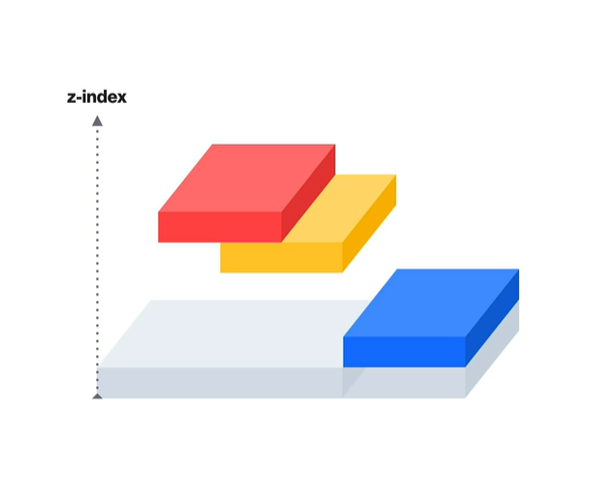
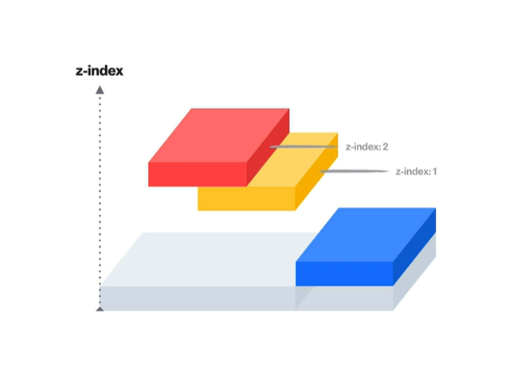

## Position

요소를 원하는 위치에 자유롭게 이동시키기 위해서 사용하는 속성

float 처럼 붕 뜨는 것

- **내가 어떤 종류의 Position를 사용하고 있는지?**

- **내가 사용하는 Position는 무엇을 기준으로 요소를 위치시키는지?**

### ① static

모든 요소는 static

### ② relative

- 기준 : 자기자신의 자리

- top, left, bottom, right

### ③ absolute

- 기준 

자신을 감싸고 있는 여러 조상 중 자신이 원하는 기준을 선택할 수 있다. 

하지만 `position : static`이 아닌 요소만 가능하다.

즉, relative | absolute | fixed | sticky 만 가능

- top, left, bottom, right

- float의 특징들과 비슷
    - 부모요소가 인식을 안함
    - `absolute`인 박스는 `block`이 된다.
    - block임에 불구하고도 `margin`이 생기지 않음

- float와 차이점
`float`는 inline의 요소를 인식을 하지만

`absolute`은 inline의 요소도 무시

### ④ fixed

- 기준 : viewport

- top, left, bottom, right

### ⑤ sticky

아직 지원하는 브라우저가 많이 있지 않기에 skip ... ^^

### ⑥ z-index

postition된 요소들의 **수직 방향**의 위치를 알려주는 속성

다만 `position : static`는 제외

즉, z축으로 내가 몇번째 레벨에 있는지

`예시 : 빨강 박스가 노랑 박스를 덮어야 하는 경우`


덮으려면 빨강 박스가 노랑 박스보다 위층에 있어야 한다.

이럴 경우에는 z-index에 정수 값을 적어줘야 한다.

```CSS
.RED {
    z-index : 2;
}

.YEELOW{
    z-index : 1;
}
```


 
▶ **다른 요소를 가려야할 때 사용!**

