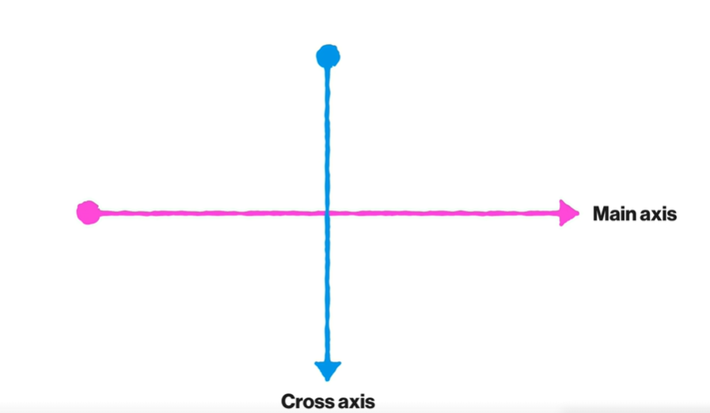
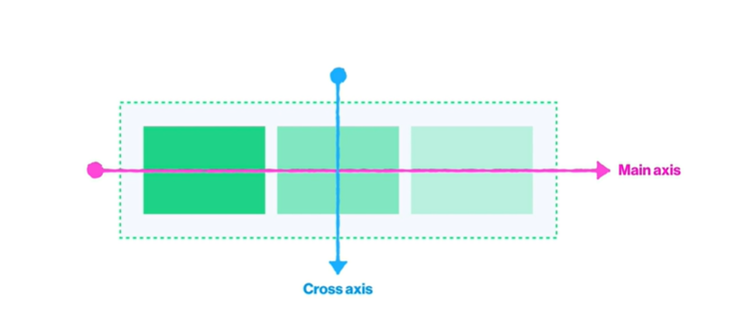
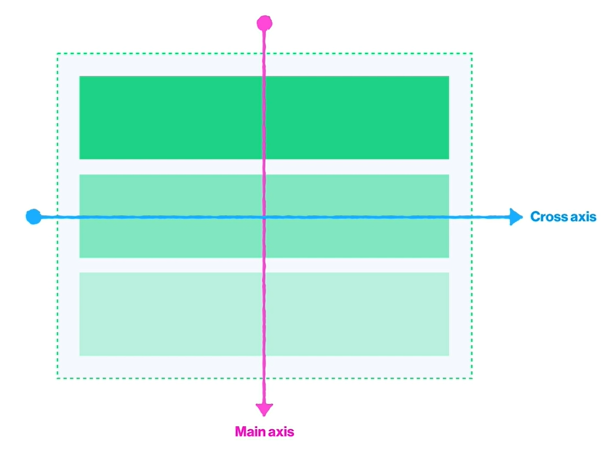
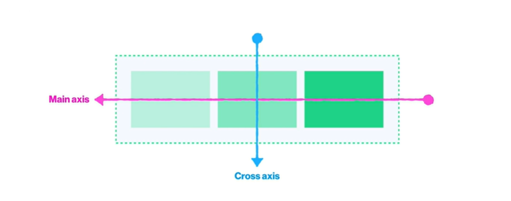
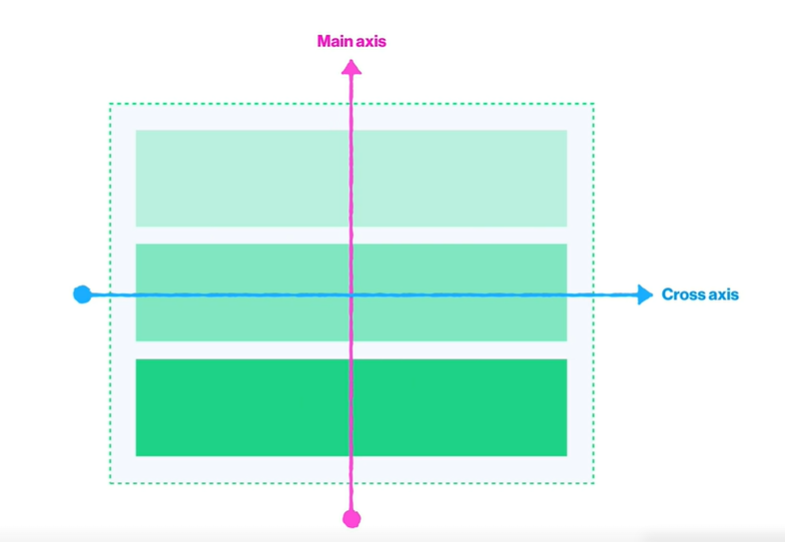

## Flexbox

### ① '나 플렉스 박스 쓸거임' 선언

내가 정렬을 하고자 하는 요소를 감싸고 있는 **부모**에게 **선언!**

```CSS
.flexbox {
    display : flex;
    /* flex(block) | inline-flex(inline-block) */
}
```

### ② 가로 정렬? 세로 정렬?

- `row` 
    가로

- `row-reverse` 
    오른쪽 부터 가로

- `column` 
    세로

- `column-reverse` 
    아래 부터 세로

```CSS
.flexbox {
    display : flex;
    flex-direction : row;
    /* row | row-reverse | column | column-reverse */
}
```

#### Axis

`flex`을 선언을 하면

우리 눈에 보이지 않는 두개의 축이 생김



`flex-direction`의 값에 따라 축의 방향이 완전히 달라짐

- `flex-direction : row`일 경우



- `flex-direction : column`일 경우



- `flex-direction : row-reverse`일 경우



- `flex-direction : column-reverse`일 경우




### ③ 무조건 한 줄 안에 다 정렬?

- `nowrap`

    감싸지 않고 자식의 사이즈를 줄여서라도 **한 줄로 정렬**

- `wrap`

    한 줄에 모두 정렬하기에 공간이 넉넉하지 않을 때,

    자식의 사이즈를 줄이지 않고 그대로 유지하면서 **여러 줄로 정렬**

```CSS
.flexbox {
    display : flex;
    flex-direction : row;
    flex-wrap: nowrap;
    /* nowrap | wrap */
}
```

### ④ 다양한 속성

- `justify-content`

    main axis 방향으로 정렬 하고 싶을 때

- `align-items`

    nowrap일 경우에만 사용 - 하나의 flexbox

    cross aixs 방향으로 정렬 하고 싶을 때

- `align-content`

    wrap일 경우는 여러개의 flexbox가 생기는데, 

    전체의 cross aixs 방향으로 정렬 하고 싶을 때


```CSS
.flexbox {
    display : flex;
    justify-content : center;
    /* flex-start | flex-end | center | space-between | space-around */

    align-items : center;
    /* flex-start | flex-end | center */

    align-content : center;
     /* flex-start | flex-end | center | space-between | space-around */
}
```

### ⑤ order

마크업 된 순서대로 스타일을 해야 한다.

```HTML
<div class="parent">
    <div class="red"> red </div>
    <div class="yellow"> yellow </div>
    <div class="blue"> blue </div>
</div>
```

예시로 보면은 red > yellow > blue

`order`의 속성을 통해 **몇 번째 위치로 가야하는지** 선언을 한다면

```CSS
.red {
    order : 3;
    background-color : red;
}

.yellow{
    order : 1;
    background-color : yellow;
}

.blue{
    order : 2;
    background-color : blue;
}
```

yellow > blue > red 로 위치해 있음