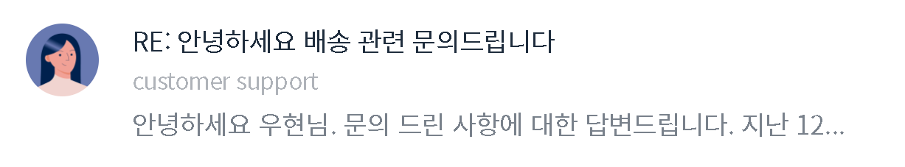

## Float 훈련 2

### Screenshot


### 배운 내용
```CSS
.card-content h1 {
    margin-bottom: 4px;
}

.card-content strong {
    display: block;
    margin-bottom: 4px;
}
```
margin top / bottom을 자주 쓰는데 초보자들이 자주 하는 실수는

top 썼다가 bottom 썼다가 중구난방으로 사용하는 실수가 있다.

일관성 있기 top을 쓸거면 웬만해선 top 사용하고 bottom을 쓸거면 

웬만해선 bottom을 사용하는게 좋다.

또한, strong 태그는 `inline`이기 때문에 margin-bottom을 사용할거면

display : block;을 사용해줘야 한다.

```CSS
.tab-menu::after {
    content: '';
    display: block;
    clear: left;
}
```
float를 사용할 때 마다 매번 `::after`를 만드는게 귀찮을 경우

범용적으로 사용할 CSS를 만들어 준다.

- 적용법

```HTML
    <div class="card clearfix">
        
        <div class="card-content">
            <h1>RE: 안녕하세요 배송 관련 문의드립니다</h1>
            <strong>
                customer support
            </strong>
            <p>
                안녕하세요 우현님. 문의 드린 사항에 대한 답변드립니다. 지난 12...
            </p>
        </div>
    </div>
```