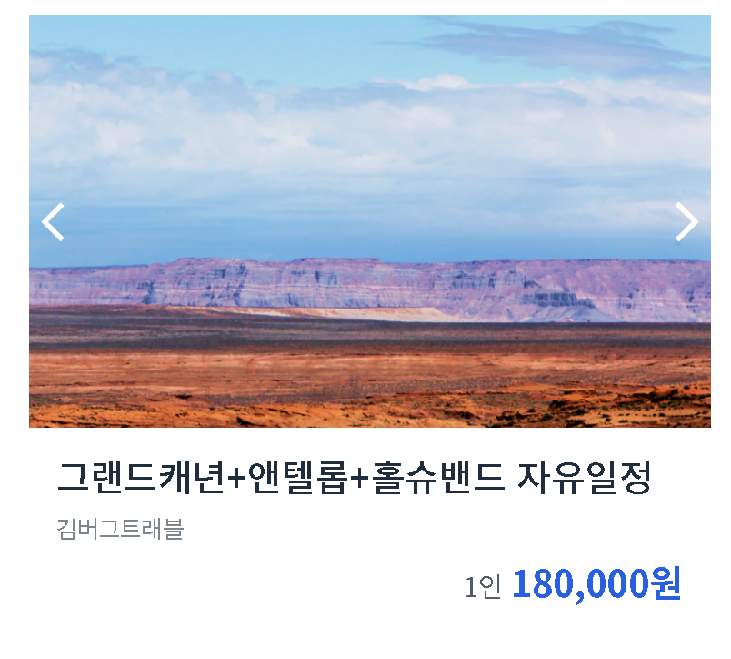

## Position 훈련 2

### Screenshot


### 배운 내용

① 이미지 사이즈 조정할 때 가장 많이 사용하는 조합

width는 부모의 width로

height는 사진 비율에 맞춰서
```CSS
img {
    width : 100%;
    height : auto;
}
```

② transform
어떤 요소를 변형 시킬 때 사용 하는 속성

- **rotate()** : 원하는 각도로
- **scale()** : 확대, 축소
- **translate(x, y)** : 위치를 이동
- **translateX()** : X축만 이동 
- **translateY()** : Y축만 이동

▶ `%`를 사용하면 자기 자신을 기준점으로 한다.

▶ `-`는 위로 위치 `+`는 아래로 위치

```CSS
.{
    transform : rotate();
    transform : scale(2 or 0.5);
    transform : translate();
    transform : translateX(50%);
    transform : translateY(50%);
}
```

