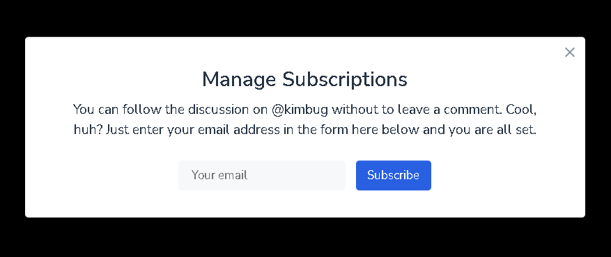

## Position 훈련 3

### Screenshot


### 배운 내용

① 버튼의 width 값을 고정 한다면

버튼 안의 글자가 길어질 경우

글자가 width 값 보다 밖으로 나갈 문제가 있고

그럴 때 마다 width 값을 계속 수정해 나가야 하기 때문에

`padding`을 사용하면 좋다!

`padding`은 글씨가 무엇이든간에

양 옆을 내가 원하는 공간만큼 주기 때문에

재사용하기 좋다!

- - -

② inline-block을 사용하면

이상한 margin이 생기기 때문에

되도록이면 inline-block을 사용하지말자..!

- - -

③ block이 자식요소로 inline-block을 갖고 있다면

inline-block 중 text 일 경우

정렬을 원한다면 `text-align`을 사용!

```CSS
{
    text-align: center;
}
```


