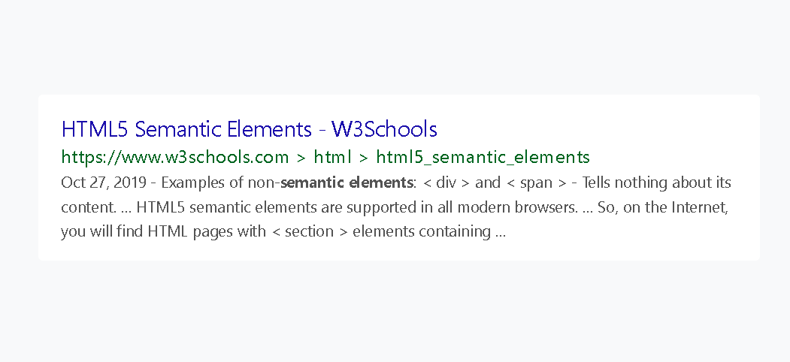

## Google Search Result Item

### Screenshot


### 배운 내용
```HTML
<div>란 어떤 것인지 <span>이란 어떤 것인지 텍스트로 설명하고 싶은데 그냥 <div> <span>이라고 적으면 
HTML은 텍스트로 인식을 안하고 태그로 인식하기에 
`HTML Escape Code`를 사용해줘야 한다.
```

<a href="https://mateam.net/html-escape-characters/">
    HTML Escape Code
</a>

**예시**
```HTML
<p>Oct 27, 2019 - Examples of non-semantic elements:
    &lt; div &gt; and &lt; span &gt; - Tells nothing about its content. ... HTML5 semantic elements are supported in
    all modern browsers. ... So, on the Internet, you will find HTML pages with &lt; section &gt; elements containing ...
</p>
```
