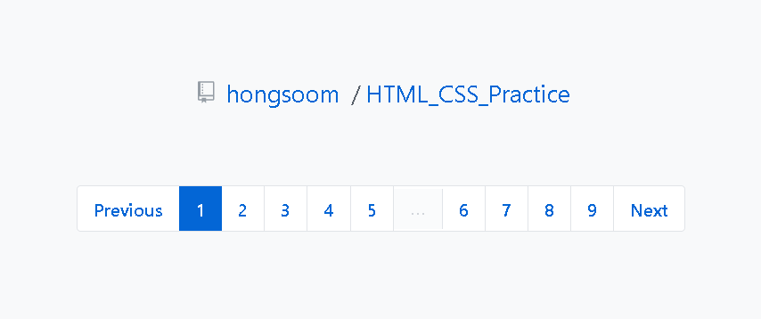

## Breadcrumb & Pagination

### Screenshot


### 배운 내용
- aria-label
우리 눈에 보이지 않더라도 브라우저에게는 전달이 되면 좋은 정보, 혹은 스크린 리더를 통해 웹을 사용하는 사용자들에게 전달해야 하는 정보를 제공하고 싶을 때 사용하는 속성
```HTML
<a href="" aria-label=""></a>
```