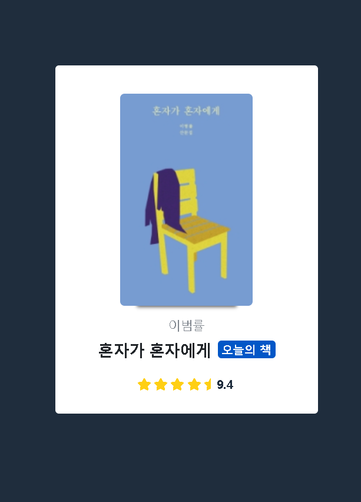

## Product Card

### Screenshot


### 배운 내용
- aria-hidden <br/>
중요한 정보가 아닐 경우, 브라우저에도 전달될 필요가 없고 스크린 리더와 같은 보조 기술을 사용하는 사용자를 대상으로 콘텐츠의 탐색을 제한 할 때 사용하는 속성
제목을 숨기는 것 같이, 일부 콘텐츠를 숨길 필요가 있음.
(이 외에도 콘텐츠 숨김 방법은 css -> display : none, visiblility : hidden 활용)
```HTML
<a href="" aria-hidden="true/false"></a>
true : 탐색 x
```