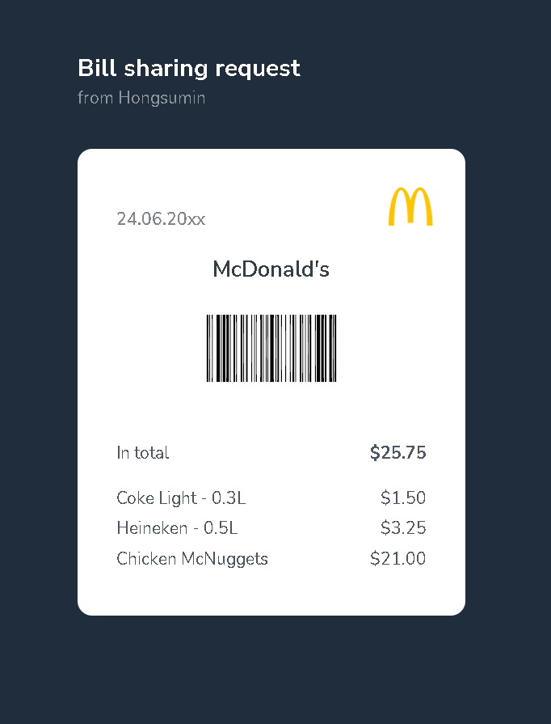

## Receipt

### Screenshot


### 배운 내용
1. 두 줄 모두 제목인데 스타일만 다를 경우 `span`태그를 사용해 스타일 처리를 해줌
```HTML
    <h1>Bill sharing request
        <span>from Hongsumin</span>
    </h1>
```

2. 그냥 이미지로 바코드를 나타낼 수 있지만, 영수증에서 중요하다고 생각하니 `strong`태그안에 이미지를 넣어 사용
즉, 중요하다고 생각하면은 `strong`태그를 사용하는 것이 좋다
```HTML
    <strong class="barcode">
        
    </strong>

    <dl>
        <dt>In total</dt>
            <dd>
                <strong>&dollar;25.75</strong>
            </dd>
    </dl>
```

3. `HTML Escape Code`
```HTML
&dollar;1.50
```

4. `aria-label`
```HTML
<dt>Coke Light - 0.3
    <span aria-label="litter">L</span>
</dt>

<span aria-label="Issued on June 24, 20xx">24.06.20xx</span>
```