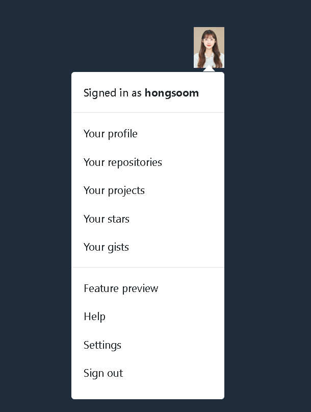

## Github Dropdown Menu

### Screenshot


### 배운 내용
비슷한 구조의 항목들이 나란히 연결이 되어있을 때 
`List`인 목록 태그를 사용하는게 의미에 맞게 정보를 전달할 수 있음
```HTML
즉, <ul> 순서가 중요하지 않은 목록 - 번호가 붙지 않는
<ol> 순서가 중요한 목록 - 번호가 붙는 둘 중 하나이여야 한다.
예제는 굳이 순서가 중요하지 않는 예시이기에 <ul>를 사용!

중요한 한가지! <ul> - <li>만 자식요소를 가지고 있기에
<a> 태그를 쓰고 싶으면
    <li>
        <a></a>
    <li>
이런식으로 감싸줘야 한다.
```
