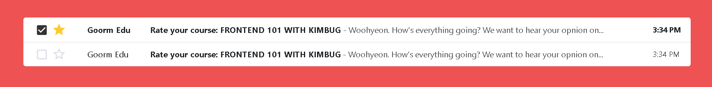

## Gmail Inbox

### Screenshot


### 배운 내용
1. list vs Table
예시는 동일한 구조가 반복되어서 두가지를 사용해서 마크업을 할 수 있지만 병렬적인 구조로 반복되어 있고 해당 되는 것의 큰 주제가 있으므로 테이블을 사용하는게 좋다!

2. 정보를 정확히 전달 및 알려야하는데 보이지 않게 하기 위해서는
`sr-only`라는 특수한 CSS 파일을 만들어 HTML 문서에는 직접 적어두되
우리 눈에는 보이지 않게 처리하는 방법

- CSS
```CSS
.sr-only {
    position: absolute;
    top: -9999px;
    left: -9999px;
    z-index: -1;
    width: 1px;
    height: 1px;
    overflow: hidden;
    visibility: hidden;
}
```

- HTML
```HTML
<label for="inbox-1" class="sr-only">Select this email</label>

<span class="sr-only">Add to favorites</span>

<strong class="sr-only">unread:</strong>

<strong class="sr-only">Read:</strong>

```

